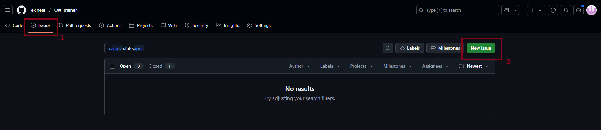

# CW_TRAINER — Ekin Efe GÜNGÖR tarafından geliştirilmiştir

**CW_TRAINER**'a hoş geldiniz. Bu araç, Mors alfabesini pratik yaparak öğrenmenize ve geliştirmenize yardımcı olmak için tasarlanmıştır.

📄 English version: [README.md](README.md)

---

## 📥 Kurulum ve Çalıştırma

1. GitHub deposundaki en son sürümün **ZIP dosyasını indirin**.

   

2. Bilgisayarınızda indirilen ZIP dosyasını bulun ve **arşivden çıkarın (unzip)**.
3. Açılan klasöre girin ve en son sürüm klasörüne (örneğin `V-1.8`) gidin.
4. `dist` klasörü içerisinde şu iki dosyayı göreceksiniz:
   - `settings.json`
   - `V-1.8.exe` (ana çalıştırılabilir dosya)

   > ⚠️ `settings.json` dosyasını ilk başta görmüyorsanız endişelenmeyin — `.exe` dosyasını ilk kez çalıştırdığınızda otomatik olarak oluşturulacaktır.

5. **`.exe` dosyasına çift tıklayarak** programı çalıştırın.

---

## ⚙️ Ayarları Düzenleme

CW_TRAINER'ı kendi ihtiyaçlarınıza göre özelleştirmek için `settings.json` dosyasını düzenleyebilirsiniz:

1. `settings.json` dosyasına sağ tıklayın ve **"Birlikte Aç"** > `Not Defteri` veya `Notepad++` seçeneğini seçin.
2. Aşağıdaki ayarları isteğinize göre değiştirin:
   - `BPM` – Dakikadaki vuruş sayısı
   - `FREQUENCY` – Ton frekansı (Hz cinsinden)
   - `LINES` – Bir oturumda çalınacak satır sayısı
   - `CHARS_PER_LINE` – Her satırdaki karakter sayısı
3. **CTRL + S** ile dosyayı kaydedin.
4. Yeni ayarların geçerli olması için `.exe` dosyasını tekrar çalıştırın.

---

## 🛠 Sorun Giderme ve Geri Bildirim

Bir hata mı ile karşılaştınız ya da öneriniz mi var? Geri bildiriminiz bu projenin gelişimi için çok önemli. Sorun bildirmek için şu adımları izleyin:

1. GitHub deposundaki [Issues](https://github.com/ekinefe/CW_Trainer/issues) sekmesine gidin.
2. **"New issue"** butonuna tıklayın.
3. Karşılaştığınız problemi veya önerinizi açık ve anlaşılır şekilde açıklayın.
4. Varsa ekran görüntüsü ekleyerek durumu daha iyi anlatabilirsiniz.

   

> 💡 Karşılaştığınız hata mesajlarını veya problemi yaşarken yaptığınız işlemleri de belirtirseniz, çözüm süreci daha hızlı olacaktır.

Katkılarınız için şimdiden teşekkür ederiz — her geri bildirim **CW_TRAINER**'ı daha iyi hale getirmek için çok değerlidir!

---

**CW_TRAINER**'ı kullandığınız için teşekkür ederiz! 🚀
