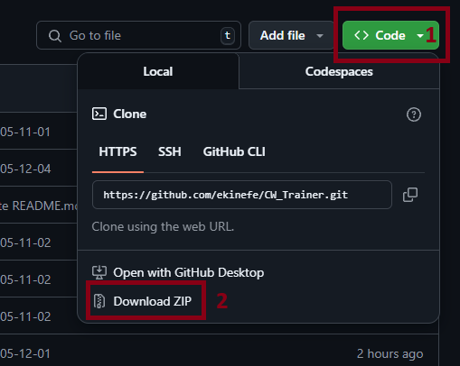
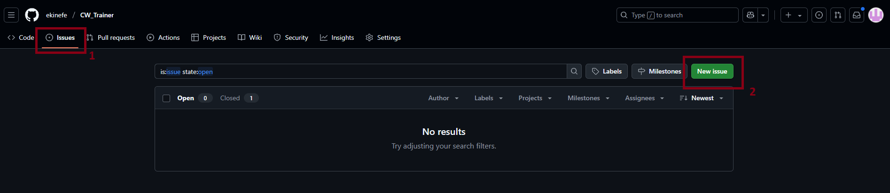

# CW_TRAINER by Ekin Efe GÜNGÖR

Welcome to **CW_TRAINER**, a Morse code training tool designed to help you practice and improve your Morse code skills.

📄 Türkçe versiyon için: [BENIOKU.md](BENIOKU.md)

---

## 📥 How to Install and Run

1. **Download the ZIP file** of the latest release from the repository.

   

2. Locate the ZIP file on your computer and **extract (unzip)** it.
3. Open the extracted folder and navigate to the latest version folder (e.g., `V-1.8`).
4. Inside the `dist` folder, you’ll find two files:
   - `settings.json`
   - `V-1.8.exe` (the main executable)

   > ⚠️ If `settings.json` is missing at first, don’t worry — it will be generated automatically after you run the `.exe` file for the first time.

5. **Double-click the `.exe` file** to run the application.

---

## ⚙️ Editing Settings

You can personalize CW_TRAINER by editing the `settings.json` file:

1. Right-click on `settings.json` and choose **"Open with"** > `Notepad` or `Notepad++`.
2. Adjust the following parameters as needed:
   - `BPM` – Beats per minute
   - `FREQUENCY` – Tone frequency in Hz
   - `LINES` – Number of lines per session
   - `CHARS_PER_LINE` – Characters per line
3. Save the file using **CTRL + S**.
4. Run the `.exe` file again to apply your updated settings.

---

## 🛠 Troubleshooting & Feedback

Encountering a bug or have suggestions? Your feedback is vital to improving this project. Here’s how you can report an issue:

1. Go to the [Issues](https://github.com/YourUsernameHere/RepoNameHere/issues) tab of this GitHub repository.
2. Click the **"New issue"** button.
3. Provide a clear description of the problem or your feature request.
4. Add screenshots if possible to help illustrate the issue.

   

> 💡 You can also include error messages or details about what you were doing when the problem occurred. This helps speed up the debugging process.

Thank you in advance for your help — every contribution helps make **CW_TRAINER** better for everyone!

---

Thank you for using **CW_TRAINER**! 🚀
